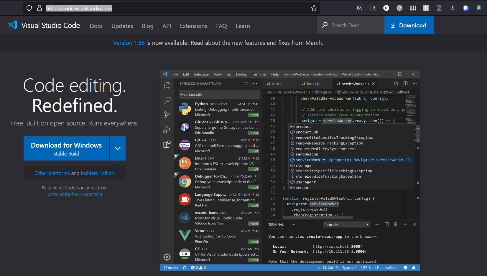
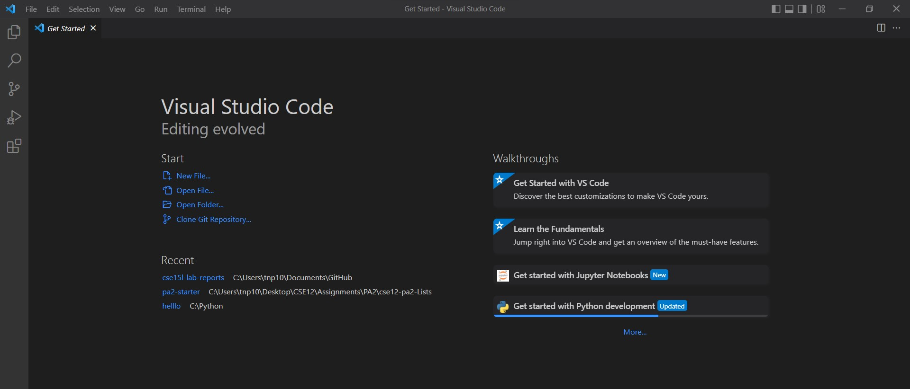
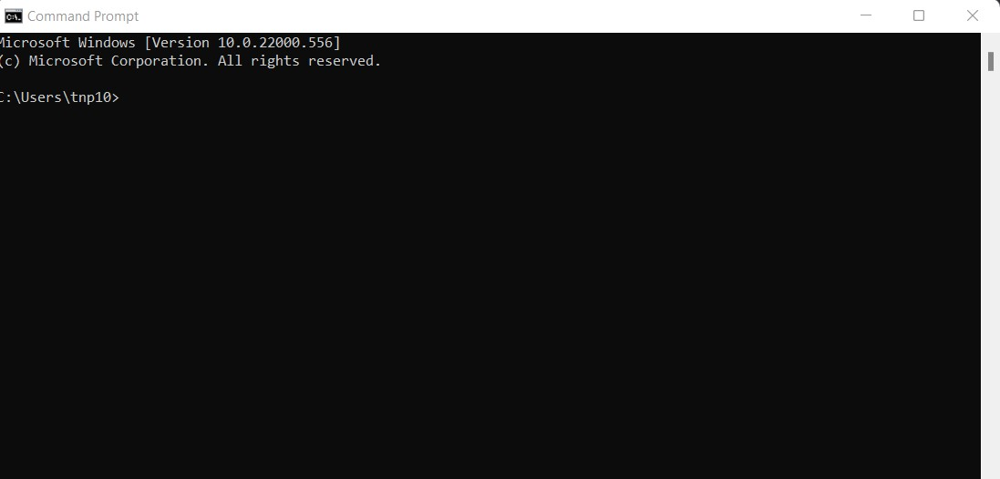
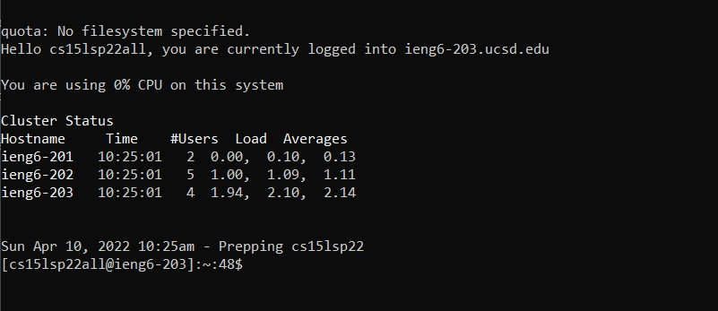
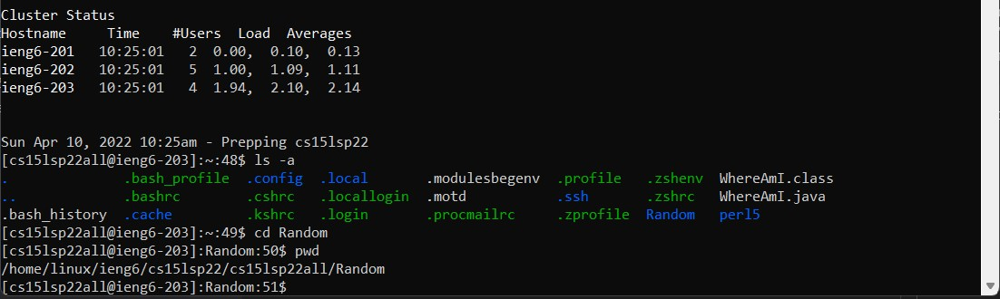
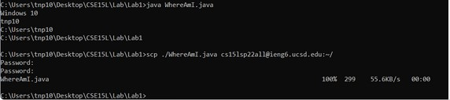
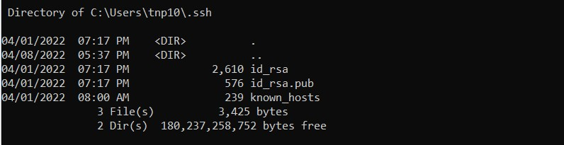
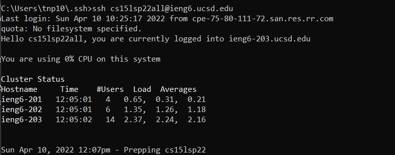
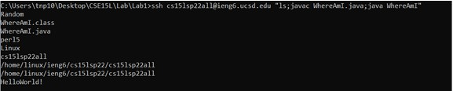

# LAB REPORT WEEK 2 🚨🚨🚨🚨🚨


# Index of other pages:
## Main page
[Phu's main page](https://pntsoi.github.io/cse15l-lab-reports/)

##  Lab 1 Report

[Lab Report 1](./Lab-Report-1/lab-report-1-week-2.md)

## nextindex page
[Next index](../nextindex.md)


# Lab Report 1 Content:

## Installing VS code:
Start by accessing this [website](https://code.visualstudio.com/) and click on Download for Windows:



After that, follow the steps and install it, you should be able to see this screen after you succeed:



## Remote connecting:
Now you want to connect to our course's remote server. Remember to change your password and activate your account first, if you haven't already. We will start with openning up the command terminal:


We'll continue by accessing cs15lsp22 server, type this:
```
ssh cs15lsp22all@ieng6.ucsd.edu
```
It will ask for your password, type that in and this screen will pop up:


Now you're in!

## Trying some commands:

We can use some UNIX commands to navigate ourselves and figure where we  are and need to go:

```
// To list the folders in the current directory:
ls 
// To navigate to a directory
cd <directory here>
//To see the current directory that you're in 
pwd
// To move folders
mv <old directory> <new directory>
```

I'll post screenshot of some of these commands:


## Moving Files with scp:
We can move files from our client side to the server side by using the ``` scp ``` command:
```
scp <directory of file on client side> <directory of file on server side>
```
Example:
```
scp ./index.txt cs15lsp22all@ieng6.ucsd.edu:~/
```



## Setting an SSH Key:
We can set up an SSH keygen so that whenever we log into the server, we won't need to type our passwords down.
We start by generating a keygen on the client by:
```
ssh-keygen
```

After that, go into the /.ssh directory on your computer and copy the public ssh key called ```id_rsa.pub ```. 



Log into your server and create a directory called ```./ssh```. 
Log out and then do:
```
scp C:\Users\<username>\.ssh\id_rsa.pub cs15lsp22all@ieng6.ucsd.edu:~/.ssh/authorized_keys
```

Now you can log into the server without having to type the password:



## Optimizing Remote Running:
Now we can log into the server without a password, this has streamlined our process to be a bit faster!
We can modify our file on the client side and then ```scp``` it onto the servers in a specific directory all in 1 or 2 command lines! We can even run some commands like ```ls```.




