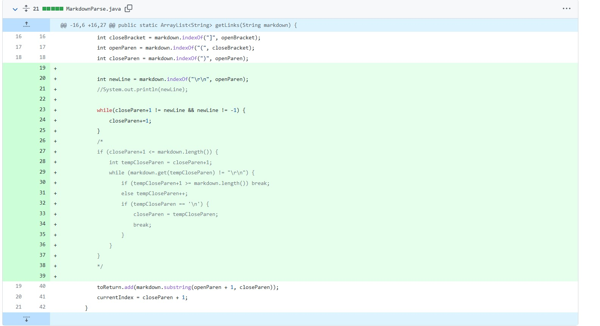
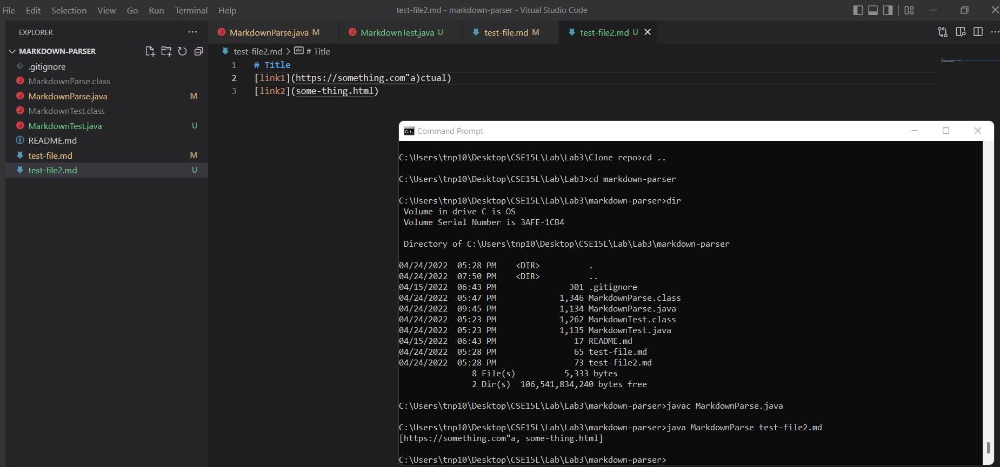
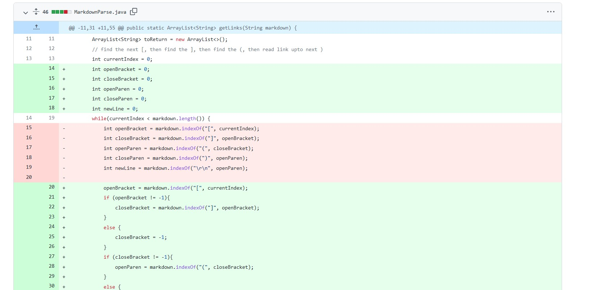
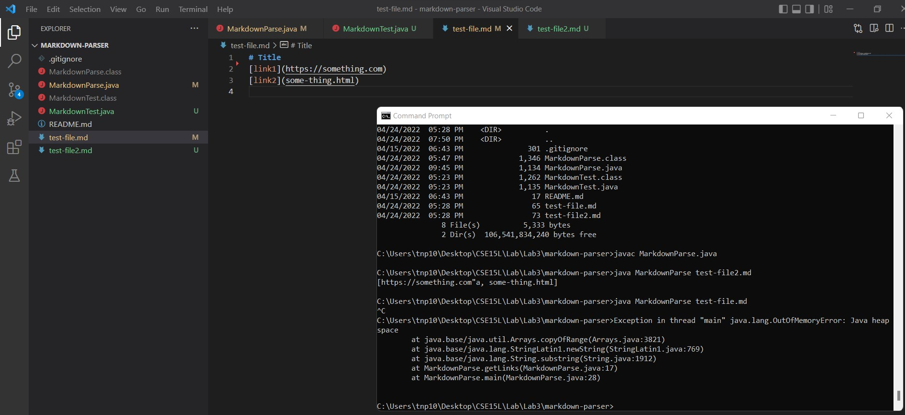
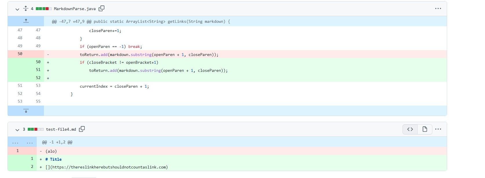

# Lab Report 2 Week 4 🚨🚨🚨🚨

## First symptom: Escape character ")"

While testing the code, we notice that running the code against a test file that includes ")" in between "()" will cause the program to escape prematurely, causing the actual link to be incomplete. [Link to the test that induce the failure](https://github.com/PnTsoi/markdown-parser/blob/main/test-file2.md)

This is the code change for the first symptom:

This is the output for the failure of the first symptom:

This is because the code finds the index of the ")" character after the first appearance of the "(" character. After that, it marks that index as the end of the link, while in reality, we don't know whether or not that index is the actual end of the link. To fix this, we check whether the character next to that index is a new line character "\r\n"

## Second symptom: infinite loop after end of file

The initial test-file.md causes this failure because there is an end line symbol at the end of the file, causing the program to stuck in infinite loop. For this and the first symptom, I used one commit for both of them. Do note that test-file3.md looks a lot like test-file2.md on github, but if you actually download the 2 files down into your computer, you'll see that test-file3.md has a end line character at the end of the file. This character is also what causes the symptom.
[Link to the test that induce the failure](https://github.com/PnTsoi/markdown-parser/blob/main/test-file3.md)

This is the code change to fix this bug:

This is the output of the bug:

This is because the program depends on the index of openBracket to set off the other indexes. When the program reaches end of the file and there exists a new line symbol, it loops another round, but this time it can't find the index of the openBracket because it's at the end of file, so it sets the index to -1. Now, the other indexes will run everything again, setting off an infinite loop. 

## Third symptom: Error when there is no content in between "[]".

If you didn't add content in between "[" and "]", then there isn't any thing to embed the link under, so for this, the link in between "(" and ")" shouldn't be considered a link. [Link to the test file](https://github.com/PnTsoi/markdown-parser/blob/main/test-file4.md). Please do note that the format on github will only show "Title" in the test-file, you should download the file to see the full content that I am describing above.

This is the wrong output when we try to run the test, we can see that it prints out a link when this shouldn't be considered as a link:

The code change for this is here:

This is because the initial code doesn't consider what content is within between the brackets and parantheses, so they allow the code to consider empty content in the bracket will. I fix this by consider whether the next index of the index of the first bracket will be the index of the second bracket. 