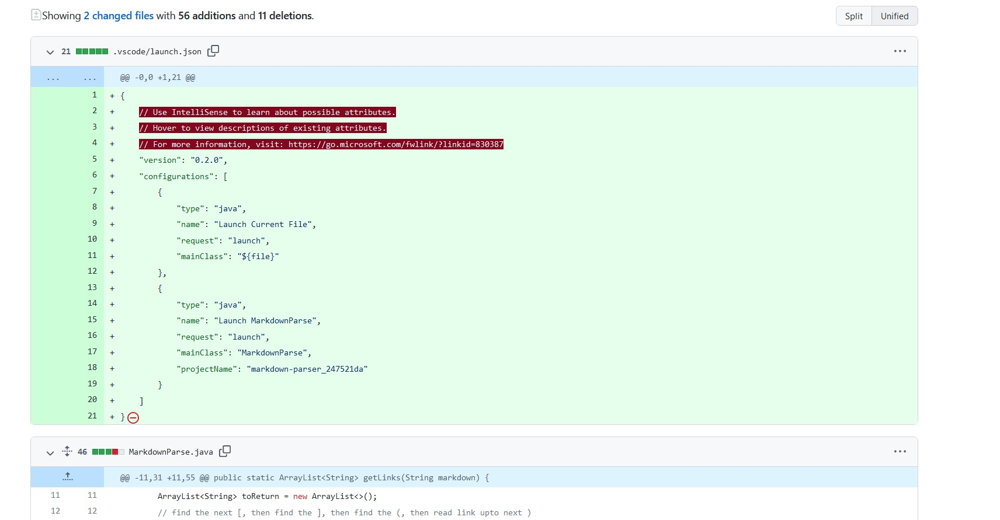
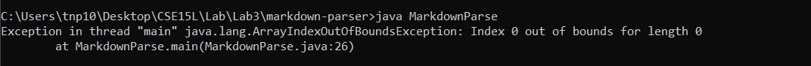
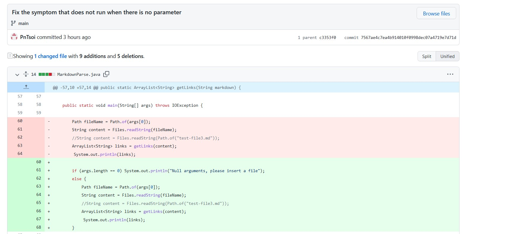

# Lab Report 2 Week 4 🚨🚨🚨🚨

## First symptom: Escape character ")"

While testing the code, we notice that running the code against a test file that includes ")" in between "()" will cause the program to escape prematurely, causing the actual link to be incomplete. [Link to the test that induce the failure](https://github.com/PnTsoi/markdown-parser/blob/main/test-file2.md)




This is because the code finds the index of the ")" character after the first appearance of the "(" character. After that, it marks that index as the end of the link, while in reality, we don't know whether or not that index is the actual end of the link. To fix this, we check whether the character next to that index is a new line character "\r\n"

## Second symptom: infinite loop after end of file

The initial test-file.md causes this failure because there is an end line symbol at the end of the file, causing the program to stuck in infinite loop. For this and the first symptom, I used one commit for both of them.
[Link to the test that induce the failure](https://github.com/PnTsoi/markdown-parser/blob/main/test-file3.md)

This is the code change to fix this bug:


This is the output of the bug:


This is because the program depends on the index of openBracket to set off the other indexes. When the program reaches end of the file and there exists a new line symbol, it loops another round, but this time it can't find the index of the openBracket because it's at the end of file, so it sets the index to -1. Now, the other indexes will run everything again, setting off an infinite loop. 

## Third symptom: Error when run with no arguments

There is no test-file for this one, but it is based on the non-existence of a test-file. If you try to run:
```
java MarkdownParse.java
```

There is no argument inserted as a parameter here, so it will produce an error:



The code change for this is here:



This is because the initial code doesn't throw an exception to remind the user to add an argument. I just added an if-else statement to prints out a reminder.
