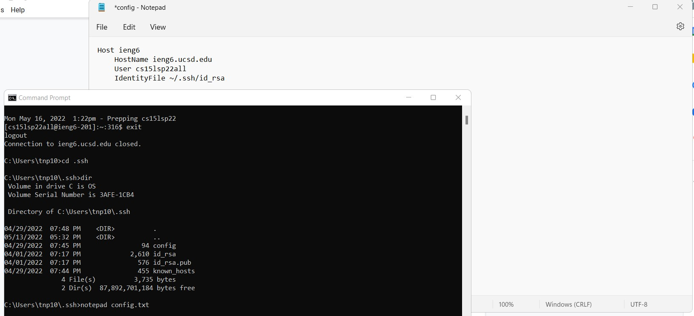
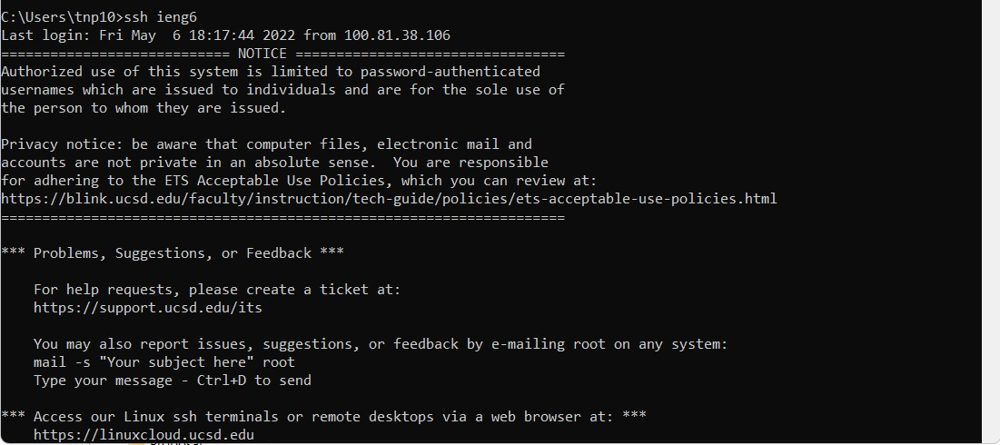
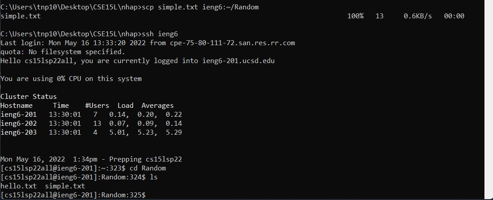
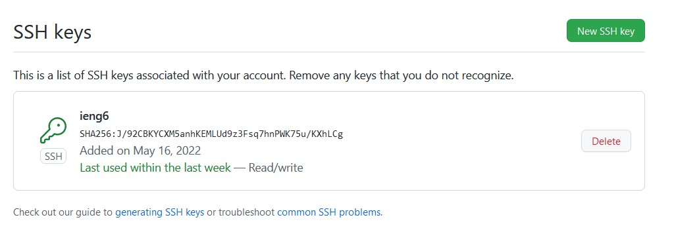
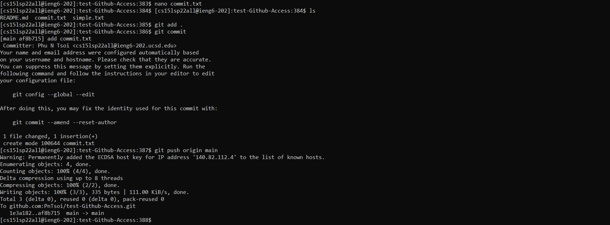
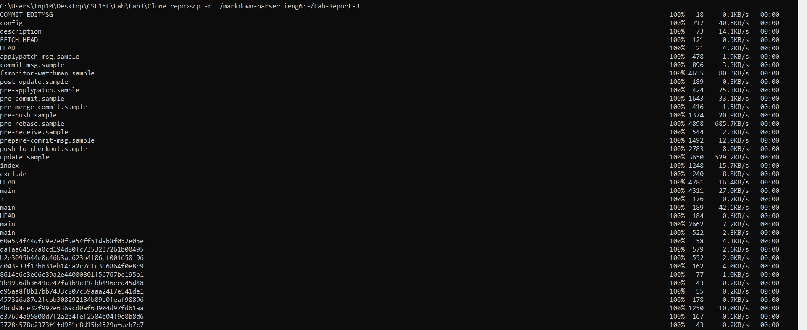
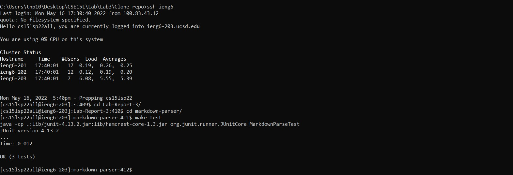
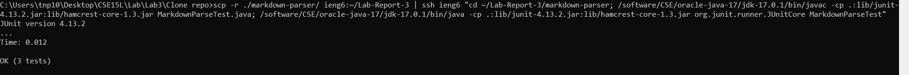

# Lab Report 3 Week 6 🚨🚨🚨🚨
### Indexes for other pages
[Main Index](./../index.md)

[Lab Report 1](./../Lab-Report-1/lab-report-1-week-2.md)

[Lab Report 2](./../Lab-Report-2/lab-report-2-week-4.md)

[Lab report 3](./../Lab-Report-3/lab-report-3-week-6.md)

[Lab Report 4](./../Lab-Report-4/lab-report-4-week-8.md)

[Lab Report 5](./../Lab-Report-5/lab-report-5-week-10.md)
## Streamlining ssh Configuration
Since Windows doesn't have a reliable text editor in the command terminal that doesn't create a .txt file, what I did was that I run

``` notepad config.txt ```

and then copy the code into the config.txt:

```
Host ieng6
    HostName ieng6.ucsd.edu
    User cs15lsp22all
    IdentityFile ~/.ssh/id_rsa
```
Since this is not exactly the config file, I will have to copy the content in config.txt to a new file called config.
```
copy config.txt config
```
then I have to delete config.txt
```
del config.txt
```
Now, I will have a config file that has the content of config.txt:



And I can log in ieng6 like this:



I can also copy a simple file  from client to server using scp:


## Setup Github Access from ieng6
For this, I created a new SSH id_ed25519 key for my ieng6 account. I added the key into ssh key agent and added it onto Github SSH:



I also have its private SSH in my ``` ~/.ssh ``` folder in ``` id_ed25519```:


Now I will change something on my local test Github repository that I created for this lab report called ```test-Github-Access```. I will commit, then push, to show that it doesn't require me to enter my password. Do note that I needed to do
```
git remote -v
git remote set-url origin git@github.com:PnTsoi/test-Github-Access.git
```
on my local repository first before I can actually use my github access ssh token.

Now I add a commit.txt file into my local repository and commit and push it:


[This is the link to the commit.](https://github.com/PnTsoi/test-Github-Access/commit/af8b715546759be30991569d8a0e324989d2d8c2)

## Copy whole directories with ```scp -r```
I can copy the whole repository from my client to my ieng6 using :

```scp -r ./markdown-parser ieng6:~/Lab-Report-3```



And I can run ```make test``` in my recently copied repository on ieng6:



Now, we can copy the repository again and run in one line:
