# Lab Report 4 Week 8 🚨🚨🚨🚨
### Indexes for other pages
[Main Index](./../index.md)

[Lab Report 1](./../Lab-Report-1/lab-report-1-week-2.md)

[Lab Report 2](./../Lab-Report-2/lab-report-2-week-4.md)

[Lab report 3](./../Lab-Report-3/lab-report-3-week-6.md)

# Links to Repositories
### [Link to my markdown-parse repository]()

### [Link to the repository that we reviewed in week 7](https://github.com/YoavGutmanUCSD/markdown-parser-2)


## **Snippet 1**:
I expect the markdown file to be like this when shown on a web browser:
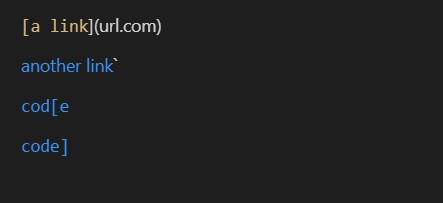

So our expected result when running markdown-parse through Snippet 1 would be:

``` ["`google.com", "google.com","ucsd.edu"] ```

For the sake of ambiguity and easier management, I write Yoav's ``` @Test ``` for the snippets in ``` MarkdownParseTest.java ``` so that it looks like mine, that way I can troubleshoot both my and their code easily. This is how my code and their code for the test looks like:

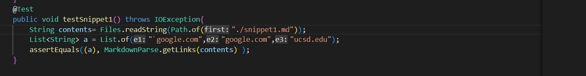

This is my output when I try to test it. My code didn't pass:
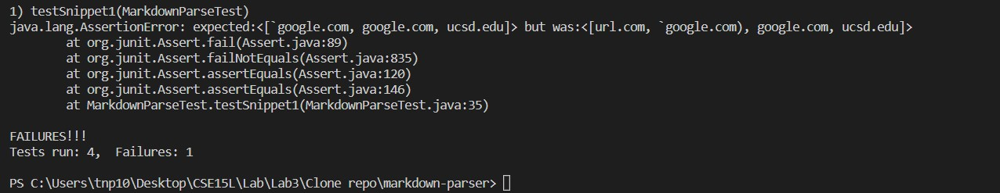

This is their output when I test it. Their code didn't pass either:
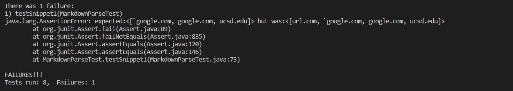

## **Snippet 2**:

The markdown file is like this when shown on a web browser (this is shown through VSCode preview):
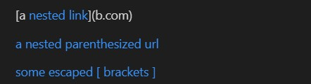

So our expected result when running markdown-parse through Snippet 1 would be:

``` ["a.com", "a.com(())","example.com"] ```

This is how my code and their code for the ```@Test``` look like:

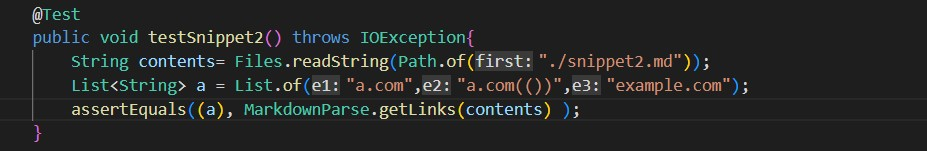

This is my output when I try to test it. My code didn't pass:
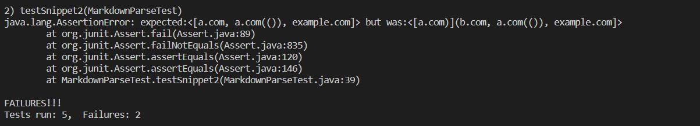

This is their output when I test it. Their code didn't pass either:
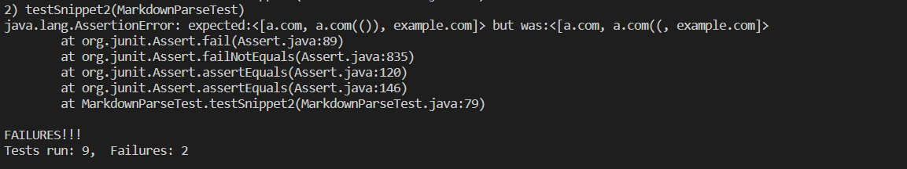

## **Snippet 3**:

The markdown file is like this when shown on a web browser (this is shown through VSCode preview):
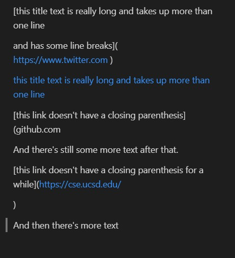

So our expected result when running markdown-parse through Snippet 3 would be:

``` ["https://sites.google.com/eng.ucsd.edu/cse-15l-spring-2022/schedule"] ```

This is how my code and their code for the ```@Test``` of snippet 3 look like:

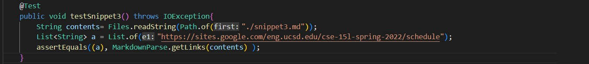

This is my output when I try to test it. My code didn't pass:
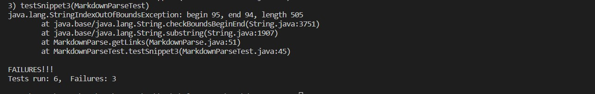

This is their output when I test it. Their code didn't pass either:
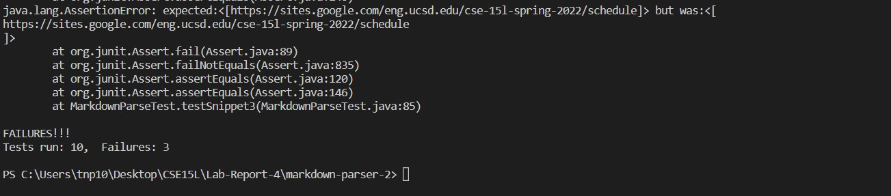


# Code fix suggestions:
## **Snippet 1**:
From reading about special characters on the documentation of markdown files, I notice that the ``` ` ``` character is actually an escape character that denotes a command in between. I think that this could be easily fix if we add a block of code to determine if the ``` `...` ``` pair has one character in between the brackets and one outside of the brackets. If such is the case, we don't collect the link in this line and we skip to the next line. Since from the markdown preview, we notice that whether or not the ``` ` ``` is in between the parentheses is not important, so we don't need to worry about the parentheses, only the brackets. 

## **Snippet 2**:
I feel like this fix would need a modification of more than 10 lines of code. Mainly because if we want to fix this completely, we would have to employ a recursive method that checks which is the inner most enclosed brackets and parentheses pairs. After that, we would have to check for ``` \ ``` as escape characters. Overall, to fix this test would take a lot of careful programming. We would also need to check for the escape characters of ```() ```, which we will close the link at where the closing parentheses cancel out with the openning parentheses.

## **Snippet 3**:
This test is very complicated to fix, so right off the bat, this would take more than 10 lines of code. After playing around with Snippet 3 in another markdown file, I notice that for the markdown file to recognize embeded links, there should not be 2 continuous new line character ```\n``` in the brackets, and there should not be more than 2 new line characters in between the parentheses. To fix this, I would set up a block of code to check for continuous new line characters, if there is then skip to the next parentheses if there is any. Then I would add another block of code to check if there are more than 2 new line characters in the parenthese, if there are then do the same as above.
