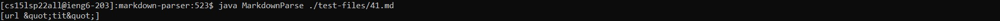

# Lab Report 5 Week 10 🚨🚨🚨🚨
### Indexes for other pages
[Main Index](./../index.md)

[Lab Report 1](./../Lab-Report-1/lab-report-1-week-2.md)

[Lab Report 2](./../Lab-Report-2/lab-report-2-week-4.md)

[Lab report 3](./../Lab-Report-3/lab-report-3-week-6.md)

[Lab Report 4](./../Lab-Report-4/lab-report-4-week-8.md)

[Lab Report 5](./../Lab-Report-5/lab-report-5-week-10.md)

## Lab report:
### Finding tests with different results
I ran the shell script again for both repository. This time, I let the ouput stream the results of the reference implementation into ``` resultsRef.txt``` and I let the output stream the results of my implementation into ```results.txt```. I then copied these two files into a common folder where I can easily process them. I run ``` vimdiff ./results.txt ./resultsRef.txt```. I subsequently choose ```41.md``` and ```481.md```.


[This is the link to test 41.md on the reference repository](https://github.com/nidhidhamnani/markdown-parser/blob/main/test-files/41.md)

[This is the link to test 481.md on the reference repository](https://github.com/nidhidhamnani/markdown-parser/blob/main/test-files/481.md)

### **41.md analysis**:
I used VS Code Preview to see what the markdown file will show up for ```41.md```:


Immediately, we can see that the Preview doesn't recognize this as a link, so the output should be: ```[]```

For this test, my implementation gives: 

``` [url &quot;tit&quot;] ```



While the reference implementation gives: ```[]```


So we can see that my implementation give the wrong result, because in reality, ```url "tit"``` is not considered a link in the VS Code Preview. This also means that the reference implementation gives the correct result.

### 41.md Bug:

For my implementation, after looking at my own code, I suppose the bug is that I don't consider ```&quot;``` as an escape character. Apparently, preview will read this string as a quotation marks and escape the link consequently. Since I've never coded this escape character into my code, so it would be obvious that my program won't be able to detect it. 

We can see here, my while loop doesn't check for this very awkward escape character:


### **481.md analysis**:

[link](/uri "title")

I used VS Code Preview to see what the markdown file will show up for ```481.md```:


Apparently, the link that I clicked into is actually ```/uri``` instead of ```/uri "title"``` shown by this picture after I clicked on the embedded link:


So the expected output would be ```[/uri]```

For this test, my implementation gives:

```[/uri "title"]```


While the reference implementation gives:

```[]```


From this, we can conclude that both implementations are incorrect. 

### 481.md bug:
I'm gonna choose my implementation to talk about this bug. This bug highlights that I need to check for spaces in between the parentheses. If there are spaces and there are no ```""``` pairs of characters after the spaces then we can disregard this link, if not we have to include the part of the link before the spaces as the actual output. My implementation fail to check this very specific "escape" condition:

As we can see here, my ```getLinks()``` method doesn't check for this very specific situation either:


